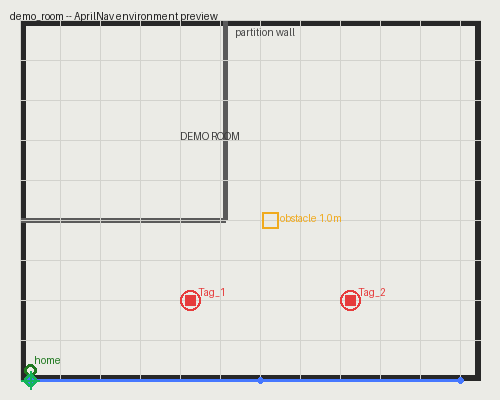

# AprilNav

**A configurable indoor quadcopter navigation & AprilTag simulation
toolbox for MATLAB / Simulink.**

AprilNav lets you define *your own* indoor flight environment — a
floor plan, real-world dimensions, AprilTag placements, obstacles, and
flight paths — through a point-and-click GUI or a plain JSON file, and
then simulates a quadcopter flying that environment: full 6-DOF flight
dynamics, a PID controller, an optional 3D VR visualization, and
AprilTag detection (simulated by proximity, or real detection from
captured photos).

It began life as a university capstone project customized for one
specific building. This release strips out every institution-specific
assumption so **anyone** can point it at their own space.

> AprilNav is a derivative of
> [cindyiskandar/Quadcopter_Control](https://github.com/cindyiskandar/Quadcopter_Control)
> (GPL-3.0, ~2022), whose flight-dynamics/control core and VR
> visualization engine this project builds on. See
> [`CREDITS.md`](CREDITS.md) for full attribution and a detailed
> account of what changed.

---

## What it does

1. **Define an environment.** Upload a floor-plan image, calibrate
   pixel-to-meter scale and an origin point, place AprilTags, draw
   flight waypoints/paths, and mark obstacles — either interactively
   (`AprilNav_EnvironmentSetup.m`) or by hand-editing a JSON file.
2. **Fly a mission.** `AprilNav_RunMission.m` drives the Simulink
   flight-dynamics/PID-control model along a staged trajectory, using
   your environment's vehicle parameters, map scale, and origin.
3. **Detect AprilTags.** As the vehicle flies, `AprilNav_AprilTag_Sim.m`
   simulates tag detections based on proximity to each tag you placed
   — or, if you have real photos of your space, `AprilNav_AprilTag_Vision.m`
   runs actual AprilTag detection on them via MATLAB's Computer Vision
   Toolbox.
4. **Review results.** `AprilNav_Results.m` plots the 3D flight path,
   per-axis tracking, and annotates the figures with when/where each
   tag was detected.
5. **(Optional) Watch it in 3D.** The Simulink model's VR Sink block
   drives a lightweight 3D Animation scene showing the quadcopter,
   spinning rotors, and its flown path over your floor plan.

---

## Quick start

```matlab
% 1. From the repo root, add the code to your MATLAB path
addpath(genpath(AprilNav_Root()));

% 2. Run the pre-flight sanity check
AprilNav_Check();

% 3a. Build your own environment interactively...
AprilNav_EnvironmentSetup();

% 3b. ...or just try the bundled demo environment
AprilNav_Env_SetActive('demo_room');

% 4. Stage a saved flight path from the active environment
AprilNav_UsePath('Out and back');

% 5. Open and run the Simulink model
%    (simulink/QuadcopterDynamics.slx, or the _R2024a variant)
%    then, after the simulation completes:
AprilNav_Results();
```

A ready-to-fly `demo_room` environment ships with the repo
(`environments/demo_room/`) with a placeholder floor plan, two
AprilTags, one obstacle, and one saved flight path — useful for
verifying your setup before building a real environment.



*The bundled `demo_room` environment: tags (red), an obstacle (yellow),
the saved "Out and back" path (blue), and the home/origin point
(green), rendered over its floor-plan image.*

---

## Repository layout

```
AprilNav/
├── LICENSE                        GPL-3.0
├── CREDITS.md                     Attribution & change log (GPL §5)
├── README.md                      This file
├── CHANGELOG.md
├── docs/
│   ├── ARCHITECTURE.md            How the pieces fit together
│   └── CONFIG_SCHEMA.md           Full environment config.json reference
├── simulink/
│   ├── QuadcopterDynamics.slx     Flight dynamics + PID control model
│   ├── QuadcopterDynamics_R2024a.slx
│   ├── VR.wrl                     3D Animation scene (generic, no branding)
│   ├── body.wrl / propeller.wrl   Vehicle geometry (MathWorks assets)
│   └── asbWaypointMarker.wrl / asbQuadcopterTrajectory.wrl
├── matlab/
│   ├── AprilNav_Root.m / AprilNav_EnvRoot.m
│   ├── AprilNav_Env_*.m           Environment CRUD (new/load/save/list/active)
│   ├── AprilNav_StructMerge.m
│   ├── AprilNav_EnvironmentSetup.m   Interactive setup GUI
│   ├── AprilNav_PlotMap.m
│   ├── AprilNav_RunMission.m      Genericized flight driver script
│   ├── AprilNav_SaveMissionFiles.m / AprilNav_UsePath.m
│   ├── AprilNav_AprilTag_Sim.m    Proximity-based tag detection (default)
│   ├── AprilNav_AprilTag_Vision.m Real image-based tag detection (optional)
│   ├── AprilNav_Obs.m             Optional obstacle-plotting helper
│   ├── AprilNav_Results.m         Post-flight plots + tag annotations
│   ├── AprilNav_Check.m           Pre-flight environment/toolbox check
│   └── asb_vrmfunc.m
└── environments/
    ├── .active                    Name of the currently active environment
    └── demo_room/
        ├── config.json
        └── map.png
```

See [`docs/ARCHITECTURE.md`](docs/ARCHITECTURE.md) for how these
pieces connect, and [`docs/CONFIG_SCHEMA.md`](docs/CONFIG_SCHEMA.md)
for the full `config.json` field reference.

---

## Requirements

- MATLAB (developed/tested against R2024a; the base `.slx` should open
  on older releases too).
- Simulink.
- **Optional:** Simulink 3D Animation (`sl3d`) — only needed for the VR
  visualization. Everything else works without it.
- **Optional:** Computer Vision Toolbox — only needed for
  `AprilNav_AprilTag_Vision.m` (real photo-based tag detection). The
  default proximity-simulation mode needs no extra toolbox.

Run `AprilNav_Check()` at any time to see exactly what's installed and
what's missing.

---

## Contributing & validation

See [`CONTRIBUTING.md`](CONTRIBUTING.md). Every environment's
`config.json` is validated on push/PR by a CI workflow
(`.github/workflows/validate-environments.yml`), and can be run
locally without MATLAB via:

```
python3 scripts/validate_environments.py
```

## Roadmap

Ideas for future contributions — none required to use the project
today, but tracked here for anyone who wants to push it further:

- Multi-vehicle simulation (fleets sharing one environment).
- A ROS 2 bridge for hardware-in-the-loop testing against a real
  flight controller.
- Automatic camera-pose-to-world-frame fusion for
  `AprilNav_AprilTag_Vision.m` (currently intentionally left to the
  user — see `docs/ARCHITECTURE.md`).
- A headless/scripted mission runner for batch-simulating many paths
  across many environments without opening the GUI each time.

## License

GNU General Public License v3.0 — see [`LICENSE`](LICENSE). This is a
derivative work of a GPL-3.0 project; any distribution of AprilNav
(modified or not) must remain under GPL-3.0. See [`CREDITS.md`](CREDITS.md).
